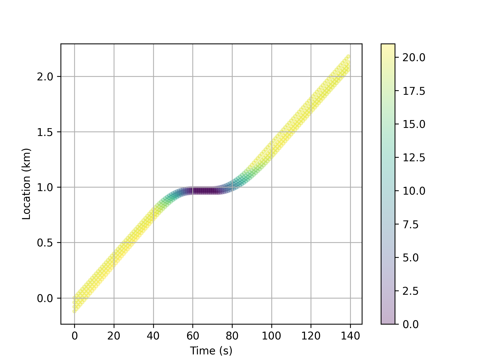
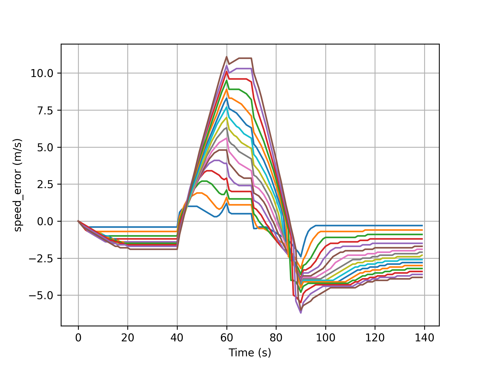

# PPO-continuous for A Reinforcement Learning-Based Vehicle Platoon Control Strategy for Reducing Energy Consumption in Traffic Oscillations
This is a concise Pytorch implementation of PPO on continuous action space with 10 tricks. 
PPO-continuous 来自一名知乎大佬写的框架
我把它修改了下使得其能用在车辆队列中。
## 10 tricks
Trick 1—Advantage Normalization. 
Trick 2—State Normalization. 
Trick 3 & Trick 4—— Reward Normalization & Reward Scaling. 
Trick 5—Policy Entropy. 
Trick 6—Learning Rate Decay. 
Trick 7—Gradient clip. 
Trick 8—Orthogonal Initialization. 
Trick 9—Adam Optimizer Epsilon Parameter. 
Trick10—Tanh Activation Function. 

## Trainning result

## 参考文献
[A Reinforcement Learning-Based Vehicle Platoon Control Strategy for Reducing Energy Consumption in Traffic Oscillations | IEEE Journals & Magazine | IEEE Xplore](https://ieeexplore.ieee.org/abstract/document/9410239)
## 使用方法
PPO_continuous_main.py 用于训练
其中train_once(args, seed = 10, Platoonsize = 3)选择课程学习的车辆数量；

ppo_test.py 用于测试；

ouput文件放置图片；

model用于放置每轮的训练结果；

models用于防止训练OK的模型权重；

## 说明
并没有完整复现，只是复现了一部分，原作者也自身开源了部分代码。
